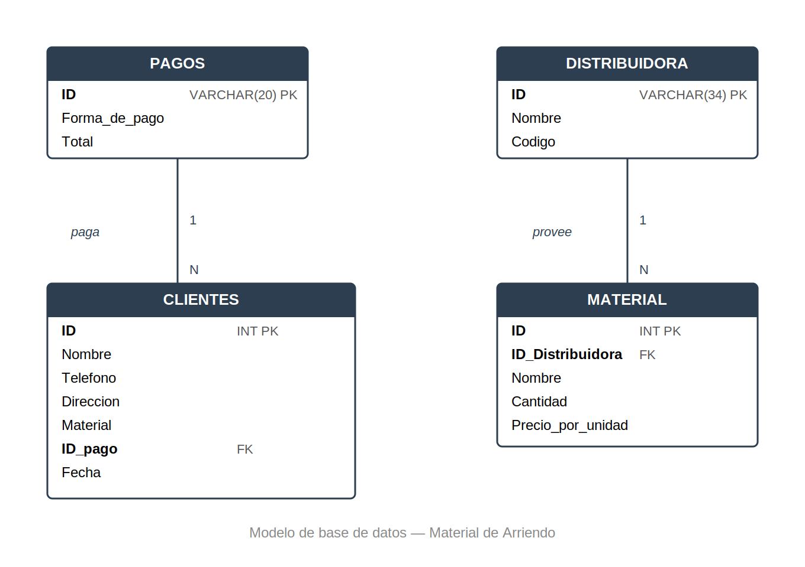

# Sistema de base de datos — Empresa de materiales de construcción (alquiler)

## Contexto

Diseño de una base de datos relacional para una empresa real del sector de
materiales de construcción, actualmente en proceso de digitalización de su
operación. El nombre de la empresa se omite por confidencialidad.

> **Nota sobre los datos:** toda la información contenida en este repositorio
> (clientes, distribuidoras, materiales, pagos) es **simulada**. Se usó para
> presentar la estructura y funcionalidad del sistema a los clientes antes de
> la implementación con información real.

## Diagrama entidad-relación

## Diseño

El sistema está compuesto por 4 tablas:

| Tabla | Descripción |
|---|---|
| **Pagos** | Registra la forma de pago y el total asociado a cada transacción |
| **Distribuidora** | Información de cada proveedor de materiales |
| **Clientes** | Datos del cliente, material solicitado y forma de pago asociada |
| **Material** | Materiales ofrecidos por cada distribuidora, con precio por unidad |

**Relaciones:**
- `Pagos` → `Clientes` (un pago puede estar asociado a varios clientes, vía `ID_pago`)
- `Distribuidora` → `Material` (una distribuidora puede ofrecer varios materiales, vía `ID_Distribuidora`)

## Herramientas utilizadas

- SQL Server

## Cómo ejecutarlo

1. Clona el repositorio.
2. Abre `create_tables.sql` en SQL Server Management Studio (o tu cliente de SQL Server preferido).
3. Ejecuta el script completo — crea la base de datos `Material_de_Arriendo` y las 4 tablas en el orden correcto (las tablas sin dependencias se crean primero, seguidas de las que tienen llaves foráneas).

## Autor

Ricardo Andrés Medina Cabarcas — Estudiante de Estadística, Universidad Nacional de Colombia.
